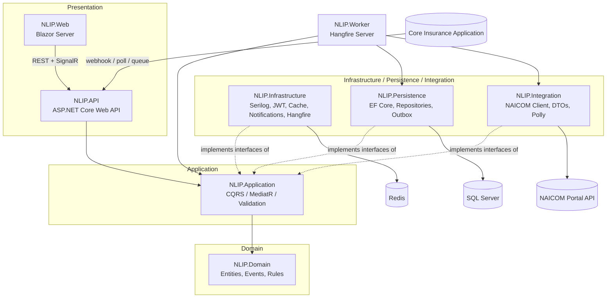
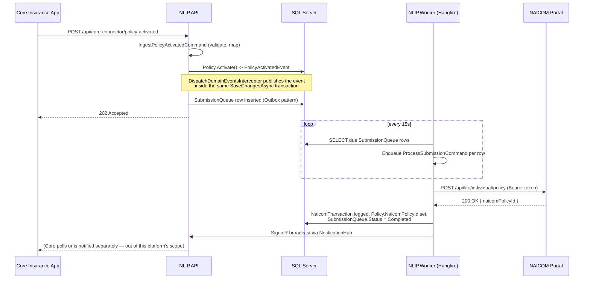
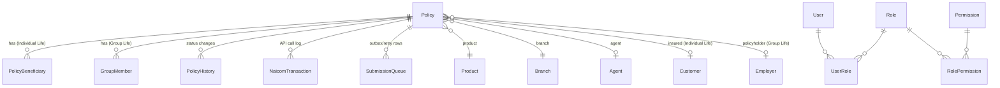

# Architecture

## Layered / Clean Architecture

Dependencies point inward only: Domain has zero dependencies; Application depends only on Domain
and Shared; Infrastructure/Persistence/Integration depend on Application (implementing its port
interfaces — `IApplicationDbContext`, `INaicomApiClient`, `INotificationService`,
`IBackgroundJobScheduler`, etc.) but Application never references them back. This is what lets
NLIP.Web talk to NLIP.API purely over HTTP/SignalR while NLIP.Worker shares the same Application/
Persistence/Integration assemblies as NLIP.API without duplicating business logic.

## Submission sequence (Policy Activated -> NAICOM Create)

On failure, the same diagram's last three steps become: log the failed `NaicomTransaction`,
increment `SubmissionQueue.RetryCount`, set `NextAttemptAt` per the backoff schedule (30s / 1m /
5m / 15m / 30m / 1h), and clear `HangfireJobId` so the outbox poller picks it up again once due.
After `MaxRetries` (configurable, default 6) the row moves to `DeadLetter` and an
Integration Administrator is notified.

## Entity relationships (core subset)

## Key design patterns and why

| Pattern | Where | Why |
|---|---|---|
| CQRS + MediatR | `NLIP.Application/Features/*` | Separates policy-lifecycle commands from dashboard/search queries; pipeline behaviors add validation/logging/audit/perf uniformly. |
| Outbox | `SubmissionQueue` + `DispatchDomainEventsInterceptor` | A policy status change and its NAICOM submission are written in one DB transaction — a crash between "policy activated" and "submission queued" cannot happen. |
| Repository + Unit of Work | `NLIP.Persistence/Repositories` | Used for master-data CRUD (Branch/Agent/Employer/Customer/Product); Policy's own CQRS handlers use `IApplicationDbContext` directly because their queries need rich joins/projections a generic repository would only get in the way of. |
| Adapter/Ports | `INaicomApiClient`, `INotificationService`, `IBackgroundJobScheduler` | Application defines the contract; Integration/Infrastructure implement it, so swapping NAICOM's transport or the job engine never touches business logic. |
| Resilience pipeline | `NLIP.Integration.Resilience.NaicomResiliencePolicies` | Bulkhead -> Circuit Breaker -> Retry -> Timeout, in that order, wraps every NAICOM HTTP call. |
| Strategy (business type) | `NaicomApiClient`, `PolicyToNaicomMappingProfile` | Picks Individual Life vs Group Life DTOs/endpoints at runtime from `Policy.BusinessType` — adding a third Life sub-type later is one new DTO + mapping + endpoint constant, not a rewrite. |

## Connector abstraction (Core Insurance Application side)

The task brief asks for a replaceable connector to the Core Application (REST, polling, message
queue, webhook). This scaffold implements the REST/webhook variant
(`NLIP.API.Controllers.CoreConnectorController`) calling the same MediatR commands
(`IngestPolicyActivatedCommand` etc.) that a polling job or a RabbitMQ/Azure Service Bus consumer
would call. Adding a polling or queue-based connector means writing a new thin adapter (a Hangfire
recurring job, or a hosted `BackgroundService` consuming a queue) that constructs the same command
objects and sends them through the same `IMediator` — no changes needed in Domain, Application, or
Persistence. See `docs/ROADMAP.md` for what's stubbed vs. built here.
